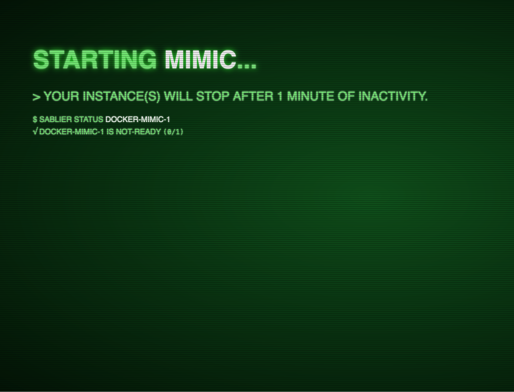

# Docker Example

This example demonstrates how to set up [Traefik](https://github.com/traefik/traefik) with [Sablier](https://github.com/sablierapp/sablier) and the [Traefik Sablier Plugin](https://github.com/sablierapp/sablier-traefik-plugin).

## Getting Started

### Prerequisites

- Docker and Docker Compose installed
- Port 8080 available on your machine

### Running the Example

1. Start the Docker Compose stack:

```bash
docker compose up
```

2. Open your browser and navigate to:

```
http://localhost:8080/
```

3. You will see the Sablier waiting screen with:


4. Wait a few seconds while Sablier starts the `mimic` container. Once ready, the page will automatically refresh and display:


5. If you stop using the service for more than 1 minute (latest request received), the container will automatically shut down. Accessing the URL again will restart the container.

### Stopping the Example

To stop and remove all containers:

```bash
docker compose down
```